Game Boy Advance Wireless Adapter (14 October 2022)
-------------------------------------------------

🌎 From: https://blog.kuiper.dev/gba-wireless-adapter 🌎

**Notes starting with "⚠️" are comments from me (Rodrigo) and not part of Corwin's original post.**

Some people may be aware that I have played around with the GBA wireless adapter, indeed I’ve made one that works over the internet but unstably. The reason that I hadn’t made this post earlier is because I wanted to make it stable before releasing the code and writing it up. Alas, I haven’t had much motivation to continue, which is a shame given I got so close.

This is the first post of a planned two. In this first post I will be talking about how the wireless adapter works, and in the second I will talk about specifically how I did all this. The short version of that second post is using the PIO on Pi Picos.

The Wireless Adapter
====================

[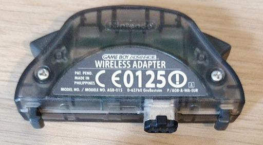](img/wirelessadapter.jpg)

*The Game Boy Advance Wireless Adapter*

The wireless adapter is a piece of hardware that connects to the link cable port of a GBA that then communicates wirelessly with other adapters. It also contains a multibootable[1](#fn:multiboot) rom for playing games only one player has a copy of (although I am not aware of many games that use it, some NES classic games use this). However, the most notable games to use it is probably the Pokémon games Fire Red, Leaf Green and Emerald (Sapphire and Ruby do _not_ have wireless adapter support)[2](#fn:list_of_games).

*You can make this screen display any game*

Communicating with the adapter
==============================

When I started, I used the following resources to start being able to talk with the wireless adapter:

*   [This Gist contains some details](wireless.txt)
*   [GBATEK has a section on the wireless adapter](gbatek.md)

Pinout
------

The wireless adapter connects using the link cable port to the GBA. It uses

*   3.3V
*   Serial In
*   Serial out
*   SD
*   Clock
*   Ground

which is all 6 of the pins. If you are going to mess with interfacing with the link cable yourself, make sure you know which pin is which. If you just want to use the wireless adapter as part of the GBA this isn’t relevant.

Serial Peripheral Interface
---------------------------

Broadly speaking the GBA communicates with the wireless adapter using the Serial Peripheral Interface (SPI), however it can be somewhat weird. In the case of the GBA this is a three or four wire protocol depending on how you count. The clock, two data wires, and what is normally chip select but operates more as a reset.

> The reason you would have a chip select normally is because then you can reuse the other three wires across all the chips on your board and switch using the chip select. On the GBA we only have one other device on this bus, so a chip select isn’t really an apt term for it.

*A logic analyser can be used to probe the link cable protocol between the GBA and a Wireless Adapter*

I will break up the ways in which you communicate into three parts:

*   Initialisation
*   Commands
*   Waiting for data

One thing to make note of is that when I have screenshots showing the logic analyser traces, these all come from Pokémon Emerald as it is what I had at the time I did a lot of this.

Initialisation
--------------

[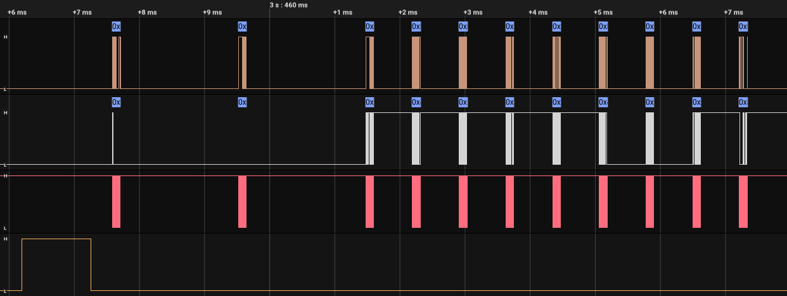](img/full_initialisation.png)

*The initialisation sequence captured using a logic analyser*

Before starting sending and receiving commands, a handshake with the adapter needs to be done. During this, the clocks runs at 256 kHz. Real games start this process by resetting the adapter.

To reset you take the reset line high. Most people refer to this as SD. You can see this in the figure.

After this the GBA sends a single command, although we will ignore this for now.

Next is the Nintendo Exchange.

### Nintendo Exchange

The GBA and the adapter exchange the word “NINTENDO” with each other in quite a strange way.

*GBA sends `0x7FFF494E` and wireless adapter sends `0x00000000`.*

The GBA here sends `0x7FFF494E`, of this the relevant part is the `0x494E`. If we look up what the bytes `0x49, 0x4E` are you will find them to be the letters `NI`. As exchanges happen simultaneously, at this point the adapter doesn’t know what to respond with and so responds with all zeros.

*GBA sends `0xFFFF494E` and wireless adapter sends `0x494EB6B1`.*

Next the GBA sends `0xFFFF494E` and now the wireless adapter does respond and responds with `0x494EB6B1`. I can assure you there is a pattern here:

*   GBA:
    *   Two _most_ significant bytes are the inverse of the adapters previous _most_ significant bytes.
    *   Two _least_ significant bytes are the GBA’s own data.
*   Adapter:
    *   Two _least_ significant bytes are the inverse of the GBA’s previous _least_ significant bytes.
    *   Two most significant bytes are the adapters own data.

The “own” data are the bytes of the string “NINTENDO”, and you advance to the next pair when the most significant bytes equal the inverse of the least significant bytes.

Following these rules the transfer looks like

<table>
    <thead>
    <tr>
        <th>GBA</th>
        <th>Adapter</th>
    </tr>
    </thead>
    <tbody>
    <tr>
        <td><code class="language-plaintext highlighter-rouge">0x7FFF494E</code></td>
        <td><code class="language-plaintext highlighter-rouge">0x00000000</code></td>
    </tr>
    <tr>
        <td><code class="language-plaintext highlighter-rouge">0xFFFF494E</code></td>
        <td><code class="language-plaintext highlighter-rouge">0x494EB6B1</code></td>
    </tr>
    <tr>
        <td><code class="language-plaintext highlighter-rouge">0xB6B1494E</code></td>
        <td><code class="language-plaintext highlighter-rouge">0x494EB6B1</code></td>
    </tr>
    <tr>
        <td><code class="language-plaintext highlighter-rouge">0xB6B1544E</code></td>
        <td><code class="language-plaintext highlighter-rouge">0x544EB6B1</code></td>
    </tr>
    <tr>
        <td><code class="language-plaintext highlighter-rouge">0xABB1544E</code></td>
        <td><code class="language-plaintext highlighter-rouge">0x544EABB1</code></td>
    </tr>
    <tr>
        <td><code class="language-plaintext highlighter-rouge">0xABB14E45</code></td>
        <td><code class="language-plaintext highlighter-rouge">0x4E45ABB1</code></td>
    </tr>
    <tr>
        <td><code class="language-plaintext highlighter-rouge">0xB1BA4E45</code></td>
        <td><code class="language-plaintext highlighter-rouge">0x4E45B1BA</code></td>
    </tr>
    <tr>
        <td><code class="language-plaintext highlighter-rouge">0xB1BA4F44</code></td>
        <td><code class="language-plaintext highlighter-rouge">0x4F44B1BA</code></td>
    </tr>
    <tr>
        <td><code class="language-plaintext highlighter-rouge">0xB0BB4F44</code></td>
        <td><code class="language-plaintext highlighter-rouge">0x4F44B0BB</code></td>
    </tr>
    <tr>
        <td><code class="language-plaintext highlighter-rouge">0xB0BB8001</code></td>
        <td><code class="language-plaintext highlighter-rouge">0x8001B0BB</code></td>
    </tr>
    </tbody>
</table>

Although note that due to the rules, the first few transfers may contain some junk data and be different to this in practice. And after this, you can start sending commands.

Commands
--------

*A command being sent by the GBA and acknowledged by the adapter*

Commands are how you tell the adapter to do things. When in command mode the clock operates at 2 mHz. Some examples of commands include connect to adapter, send message, and receive message. All commands follow the same form:

*   Command
    
    The command is a 32 bit value of the form `0x9966LLCC`:
    
    *   LL
        *   The length of the data payload in number of 32 bit values. For example here it is `0x01`, so one value is transmitted after this.
    *   CC
        *   The command type, there are a bunch of these! In this case the command type is `0x17`.
*   Data
    
    All the data along with the command, must transmit the number given in the command
    
*   Acknowledge
    
    The adapter responds with a command, the length is the number of 32 bit values and the command type is always what you send + `0x80`. In this case the length is zero and the command is `0x17` + `0x80` = `0x97`.
    
    ⚠️ When you send invalid commands or a one you're not supposed to send in the current state (like sending a `0x1d` before a `0x1c`), the adapter responds `0x996601ee`. I guess that if you read the next word (as the response size is `01`), it gives you an error code.

*   Response
    
    The data that the adapter responds with. Equal to the length given in the acknowledgement.

*   Ready
    
    In the figure, you’ll see that after exchanging any 32 bit value using SPI, some out of clock communication happens. This is the GBA and the Adapter signalling to each other that they are ready to communicate. This happens over the following stages:
    
    1.  The GBA goes low as soon as it can
    2.  The adapter goes high.
    3.  The GBA goes high.
    4.  The adapter goes low _when it’s ready_.
    5.  The GBA goes low when it’s ready.
    6.  The GBA starts a transfer, clock starts pulsing, and both sides exchange the next 32 bit value.

⚠️ If this acknowledge procedure doesn't complete, the adapter "gives up" after ~800μs and start listening again for commands. That means that if a game doesn't implement this logic, it has to wait almost 1 millisecond between transfers (vs ~40μs in normal scenarios).

⚠️ Also, the ACK protocol is different after a [Wait](#waiting) command:

    1.  The GBA goes high as soon as it can
    2.  The adapter goes high.
    3.  The GBA goes low _when it’s ready_.
    4.  The adapter goes low when it’s ready.
    5.  The adapter starts a transfer, clock starts pulsing, and both sides exchange the next 32 bit value.

Whenever either side expects something to be sent from the other (as SPI is always dual direction, although one side is often not used), the value `0x80000000` is used.

### List of commands

#### Finish Initialisation - `0x10` and `0x3d`

[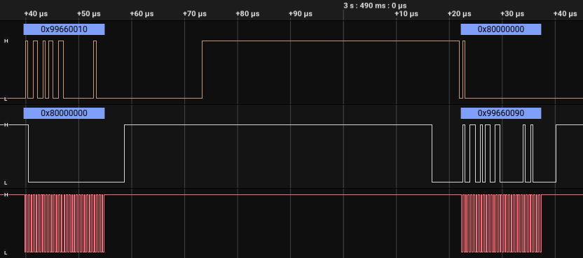](img/0x10.png)

*   Send length: 0, Response length: 0
    
*   First thing to be called after finishing the initialisation sequence.
    

#### Broadcast - `0x16`

[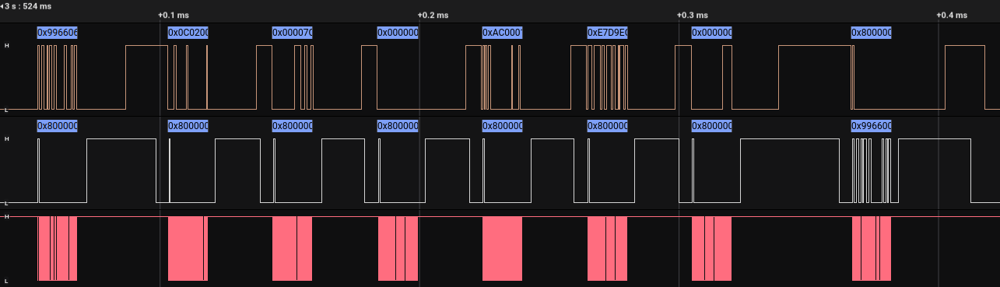](img/0x16.png)

*   Send length: 6, response length: 0
    
*   The data to be broadcast out to all adapters. Examples of use include the union room, broadcasting game name and username in download play, and the username in direct multiplayer in Pokémon.

⚠️ This is the command used to start a server. The 6 parameters are the ASCII characters of the game and user name, plus some bytes indicating whether the server should appear in the Download Play list or not. Here's a byte by byte explanation:

[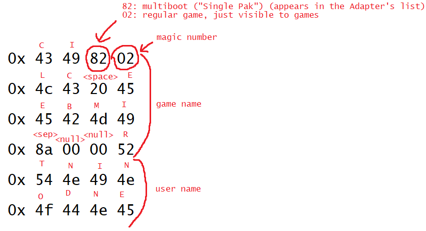](img/broadcast.png)

(if you read from right to left, it says `ICE CLIMBER` - `NINTENDO`)

#### Start Host - `0x19`

*   Send length: 0, response length: 0
    
*   This uses the broadcast data given by the broadcast command and actually does the broadcasting.
    
#### BroadcastRead - `0x1d` and `0x1e` (⚠️ and `0x1c`)

[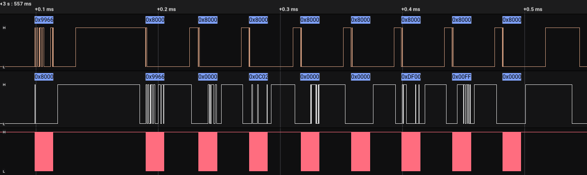](img/0x1d.png)

*   Send length: 0, response length: 7 \* number of broadcasts
    
*   All currently broadcasting devices are returned here along with an ID at the start of each. I’m not sure how unique IDs are.
*   IDs I’ve observed have been 16 bits.

⚠️ IDs are randomly generated. Each time you broadcast or connect, the adapter assigns you a new id.

⚠️ Reading broadcasts is a three-step process: First, you send `0x1c` (you will get an ACK instantly), and start waiting until the adapter retrieves data (games usually wait 1 full second). Then, send a `0x1d` and it will return what's described above. Lastly, send a `0x1e` to finish the process (you can ignore what the adapter returns here). If you don't send that last `0x1e`, the next command will fail.

#### Setup - `0x17`

[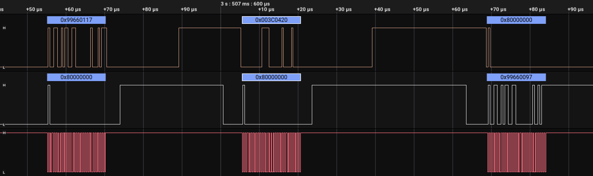](img/0x17.png)

*   Send length: 1, response length: 0
    
*   Games set this. Not sure what affect this has[3](#i-know-more), Pokemon uses `0x003C0420`.

⚠️ The multiboot ROM that the adapter sends when no cartridge is inserted also uses `0x003C0420`. It doesn't seem related to Pokemon.

#### IsConnectAttempt - `0x1a`

*   Send length: 0, response length: 0+
    
*   Responds with the ID of the adapter that wants to connect, or the length of the response is zero if no adapter wants to connect.
*   Don’t know if multiple IDs can be included here[3](#i-know-more). ⚠️ Yes!

⚠️ I would rename this command to `AcceptConnections`. When acting as a host, games frequently call this method. Though this doesn't really **accepts** new connections (the adapter does it regardless of whether you call this command or not), it returns a list with all the connected adapter IDs, and it's important for keeping the server (and other clients) informed about who's connected.

⚠️ If this command reports 3 connected consoles, after turning off one of them, it will still report 3 consoles. Servers need to detect timeouts in other way.

#### Connect - `0x1f`

[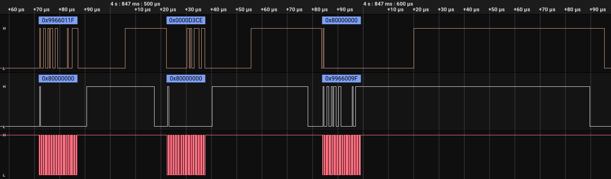](img/0x1f.png)

*   Send length: 1, response length: 0
    
*   Send the ID of the adapter you want to connect to from [BroadcastRead](#broadcastread---0x1d-and-0x1e-%EF%B8%8F-and-0x1c).
    

#### IsFinishedConnect - `0x20`

[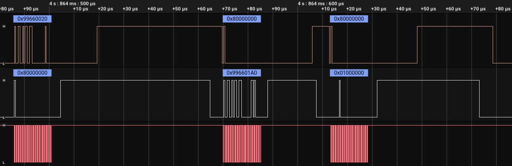](img/0x20.png)

*   Send length: 0, response length: 1
    
*   Responds with 16 bit ID as lower 16 bits if finished, otherwise responds with `0x01000000`.
    
⚠️ It also responds in its bits 16 and 17 a number that represents the `clientNumber` (0 to 3). Lets say our ID is `abcd`, it will respond `0x0000abcd` if we are the first client that connects to that server, `0x0001abcd` if we are the second one, `0x0002abcd` third, and `0x0003abcd` fourth. Games allow 5 simultaneous adapters at max.

#### FinishConnection - `0x21`

[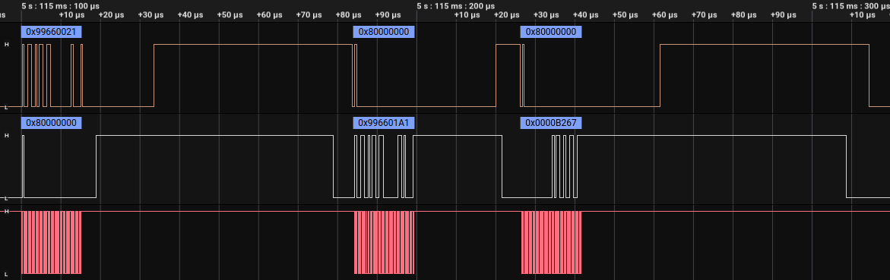](img/0x21.png)

*   Send length: 0, response length: 1
    
*   Called after [IsFinishedConnect](#isfinishedconnect---0x20), responds with the same ID as in that response ⚠️ (and zeros in its high 16 bits, like `0x0000abcd`)
    

#### SendData - `0x24`

*   Send length: N, response length: 0
    
*   Send N 32 bit values to connected adapter.
    
⚠️ The first byte **is a header**, and has to be correct. Otherwise, the adapter will ignore the command and won't send any data. The header is as follows:
- For hosts: the number of `bytes` that come next. For example, if we want to send `0xaabbccdd` and `0x12345678` in the same command, we need to send:
  * `0x00000008`, `0xaabbccdd`, `0x12345678`.
- For guests: `(1 << (3 + (1+clientNumber) * 5)) * bytes`. The `clientNumber` is what I described in [IsConnectAttempt](#isfinishedconnect---0x20). For example, if we want to send a single 4-byte value (`0xaabbccdd`):
  * The first client should send: `0x400`, `0xaabbccdd`
  * The second client should send: `0x8000`, `0xaabbccdd`
  * The third client should send: `0x100000`, `0xaabbccdd`
  * The fourth client should send: `0x2000000`, `0xaabbccdd`

⚠️ Each `SendData` can send up to:
- **Host:** 90 bytes (or 22 values)
- **Guests:** 16 bytes (or 4 values)
- *(the header doesn't count)*

⚠️ Note that when having more than 2 connected adapters, data is not transferred between different guests. If a guest wants to tell something to another guest, it has to talk first with the host with `SendData`, and then the host needs to relay that information to the other guest.

⚠️ The command "overrides" previous data, so if one node is using `ReceiveData`, but before the receive call the other node uses two consecutive `SendData`s, the receiving end will only get the last stream.

#### SendDataWait - `0x25`

[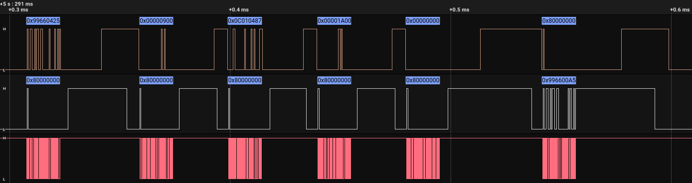](img/0x25.png)

*   Send length: N, response length: 0
    
*   The same as [SendData](#senddata---0x24) but with the additional effect of [Wait](#wait---0x27)
*   See [Waiting](#waiting) for more details on this.

#### ReceiveData - `0x26`

[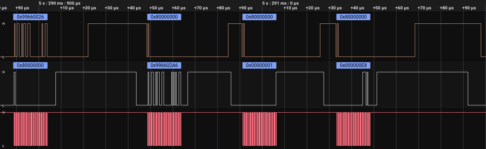](img/0x26.png)

*   Send length: 0, response length: N
    
*   Responds with all the data from all adapters. No IDs are included, this is just what was sent concatenated together.
*   Once data has been pulled out, it clears the data buffer, so calling this again can only get new data.

⚠️ When the data is concatenated, only one **header** (see [SendData](#senddata---0x24)) is included at the first value of the response.

#### Wait - `0x27`

[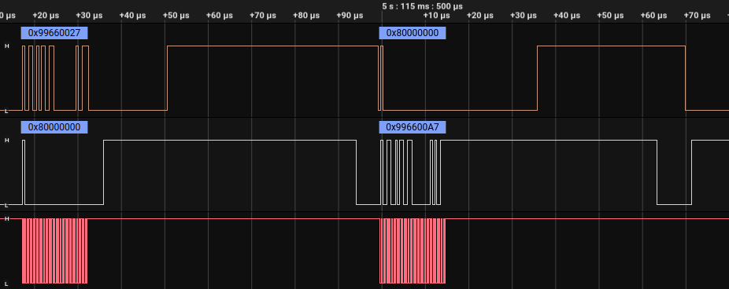](img/0x27.png)

*   Send length: 0, response length: 0
    
*   See [Waiting](#waiting) for more details on this.
    

### List of commands that I don’t quite know the meaning of [3](#i-know-more)

#### `0x11`

[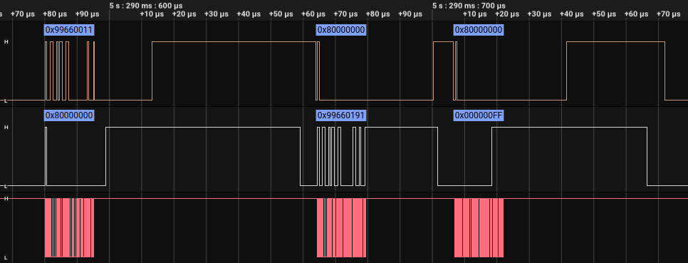](img/0x11.png)

*   Send length: 0, response length: 1
    
*   I think this is signal level of the adapters.
*   I generally set this to `0xFF`.
*   If my theory is correct then up to 3 bytes could be included each referring to the signal strength of the potentially connected 3 devices.

#### `0x13`

*   Send length: 0, response length: 1
    
*   I generally set the response to `0x00`.
    

#### `0x30`

[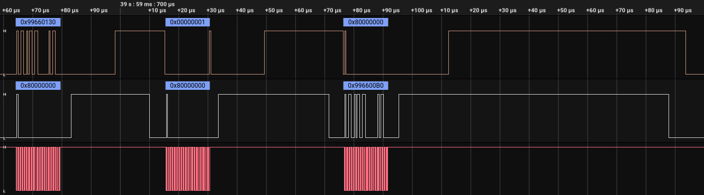](img/0x30.png)

*   Send length 1, reponse length: 0
    
*   This is very important, is the end of every connection I’ve seen.
*   Send is always `0x1`.
*   Appears to reset the adapter in some way:
    *   Disconnects
    *   Stops broadcasting
    *   Clears buffers?[3](#i-know-more)

Waiting
-------

[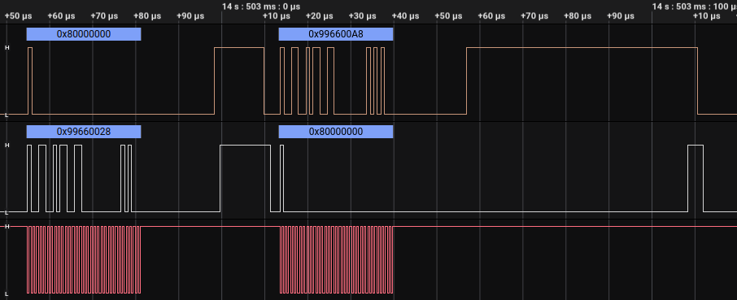](img/wake-up.png)

*   After either [SendDataWait](#senddatawait---0x25) or [Wait](#wait---0x27), clock control switches to the wireless adapter.
*   Once the adapter has something to tell the GBA about, the _adapter_ sends a command to the GBA, `0x99660028`.
*   These transfers are dealt with in much the same way as before but with the roles of the GBA and the adapter reversed, see the figure!
*   The GBA then sends the response back, `0x996600A8` as `0x28` + `0x80` = `0xA8`.
*   After this, control of the clock returns to the GBA, and it can start sending commands back again. For example this might be receiving the command sent by the other device using [ReceiveData](#receivedata---0x26).

⚠️ This timeouts after 500ms of the adapter not having anything to tell the GBA about. In this case, the adapter sends `0x99660027` instead of `0x99660028`, having the same effect and switching things back to normal.

SPI config
----------

⚠️ Here's how SPI works on the GBA:

[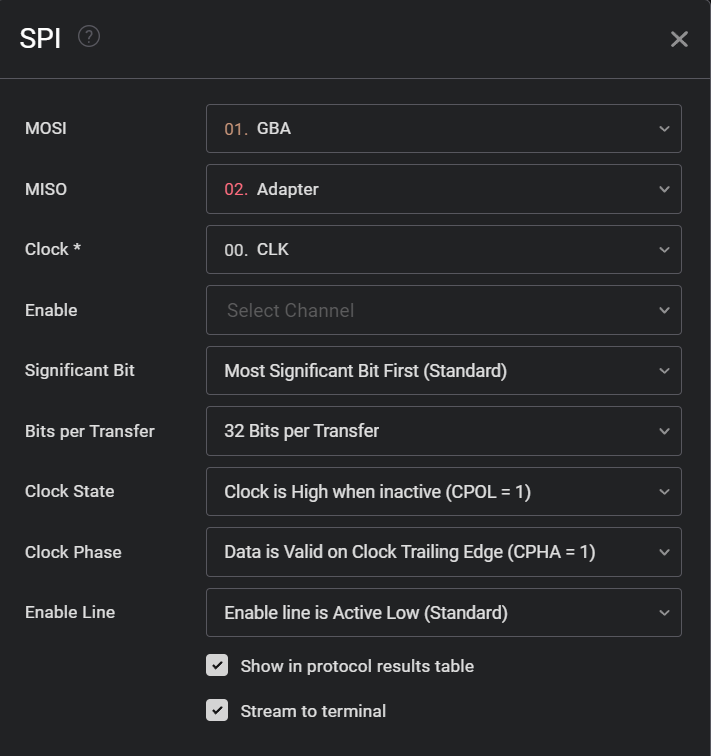](img/logic2.png)

I know more!
============

If you know any extra details about the wireless adapter, get in touch!. For specific details I’ve left footnotes around if you happen to know that piece of information[3](#i-know-more).

1.  Multiboot is what we call a rom that can be booted over link cable. This can be used for something akin to download play software for the DS. [↩︎](#fnref:multiboot)
    
2.  [Games compatible with the wireless adapter](https://en.wikipedia.org/wiki/Game_Boy_Advance_Wireless_Adapter#Compatible_games) [↩︎](#fnref:list_of_games)
    
3.  [Send me an email if you know more about this](https://blog.kuiper.dev/contact) [↩︎](#fnref:email_me) [↩︎2](#fnref:email_me:1) [↩︎3](#fnref:email_me:2) [↩︎4](#fnref:email_me:3) [↩︎5](#fnref:email_me:4)