## Game Boy Advance Wireless Adapter

- 🌎 **Original post**: https://blog.kuiper.dev/gba-wireless-adapter 🌎
- ✏️ **Updates**: [@davidgfnet](https://github.com/davidgfnet) and I were discovering new things and we added them here!

> You can learn more details by reading [LinkRawWireless.hpp](../lib/LinkRawWireless.hpp)'s code.

# The Wireless Adapter

[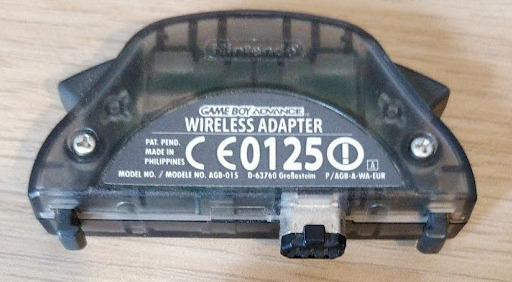](img/wireless/wirelessadapter.jpg)

_The Game Boy Advance Wireless Adapter_

The wireless adapter is a piece of hardware that connects to the link cable port of a GBA that then communicates wirelessly with other adapters. It also contains a multibootable[1](#fn:multiboot) rom for playing games only one player has a copy of (although I am not aware of many games that use it, some NES classic games use this). However, the most notable games to use it is probably the Pokémon games Fire Red, Leaf Green and Emerald (Sapphire and Ruby do _not_ have wireless adapter support)[2](#fn:list_of_games).

[](img/wireless/multiboot.jpg)

_You can make this screen display any game_

# Communicating with the adapter

When I started, I used the following resources to start being able to talk with the wireless adapter:

- [This Gist contains some details](https://gist.github.com/iracigt/50b3a857e4d82c2c11d0dd5f84ecac6b)
- [GBATEK has a section on the wireless adapter](gbatek.md)

## Pinout

The wireless adapter connects using the link cable port to the GBA. It uses

- 3.3V
- Serial In
- Serial out
- SD
- Clock
- Ground

which is all 6 of the pins. If you are going to mess with interfacing with the link cable yourself, make sure you know which pin is which. If you just want to use the wireless adapter as part of the GBA this isn’t relevant.

## Serial Peripheral Interface

Broadly speaking the GBA communicates with the wireless adapter using the Serial Peripheral Interface (SPI), however it can be somewhat weird. In the case of the GBA this is a three or four wire protocol depending on how you count. The clock, two data wires, and what is normally chip select but operates more as a reset.

> The reason you would have a chip select normally is because then you can reuse the other three wires across all the chips on your board and switch using the chip select. On the GBA we only have one other device on this bus, so a chip select isn’t really an apt term for it.

[](img/wireless/init.png)

_A logic analyser can be used to probe the link cable protocol between the GBA and a Wireless Adapter_

I will break up the ways in which you communicate into three parts:

- Initialisation
- Commands
- Waiting for data

One thing to make note of is that when I have screenshots showing the logic analyser traces, these all come from Pokémon Emerald as it is what I had at the time I did a lot of this.

## Initialisation

[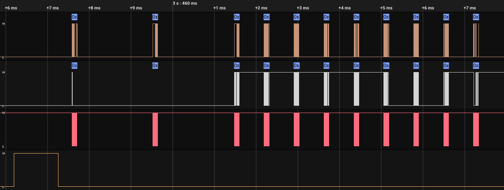](img/wireless/full_initialisation.png)

_The initialisation sequence captured using a logic analyser_

Before starting sending and receiving commands, a handshake with the adapter needs to be done. During this, the clocks runs at 256 kHz. Real games start this process by resetting the adapter.

To reset you take the reset line high. Most people refer to this as SD. You can see this in the figure.

After this the GBA sends a single command, although we will ignore this for now.

Next is the Nintendo Exchange.

### Nintendo Exchange

The GBA and the adapter exchange the word “NINTENDO” with each other in quite a strange way.

[](img/wireless/first_single_u32.png)

_GBA sends `0x7FFF494E` and wireless adapter sends `0x00000000`._

The GBA here sends `0x7FFF494E`, of this the relevant part is the `0x494E`. If we look up what the bytes `0x49, 0x4E` are you will find them to be the letters `NI`. As exchanges happen simultaneously, at this point the adapter doesn’t know what to respond with and so responds with all zeros.

[](img/wireless/first_nintendo_32.png)

_GBA sends `0xFFFF494E` and wireless adapter sends `0x494EB6B1`._

Next the GBA sends `0xFFFF494E` and now the wireless adapter does respond and responds with `0x494EB6B1`. I can assure you there is a pattern here:

- GBA:
  - Two _most_ significant bytes are the inverse of the adapters previous _most_ significant bytes.
  - Two _least_ significant bytes are the GBA’s own data.
- Adapter:
  - Two _least_ significant bytes are the inverse of the GBA’s previous _least_ significant bytes.
  - Two most significant bytes are the adapters own data.

The “own” data are the bytes of the string “NINTENDO”, and you advance to the next pair when the most significant bytes equal the inverse of the least significant bytes.

Following these rules the transfer looks like

<table>
    <thead>
    <tr>
        <th>GBA</th>
        <th>Adapter</th>
    </tr>
    </thead>
    <tbody>
    <tr>
        <td><code class="language-plaintext highlighter-rouge">0x7FFF494E</code></td>
        <td><code class="language-plaintext highlighter-rouge">0x00000000</code></td>
    </tr>
    <tr>
        <td><code class="language-plaintext highlighter-rouge">0xFFFF494E</code></td>
        <td><code class="language-plaintext highlighter-rouge">0x494EB6B1</code></td>
    </tr>
    <tr>
        <td><code class="language-plaintext highlighter-rouge">0xB6B1494E</code></td>
        <td><code class="language-plaintext highlighter-rouge">0x494EB6B1</code></td>
    </tr>
    <tr>
        <td><code class="language-plaintext highlighter-rouge">0xB6B1544E</code></td>
        <td><code class="language-plaintext highlighter-rouge">0x544EB6B1</code></td>
    </tr>
    <tr>
        <td><code class="language-plaintext highlighter-rouge">0xABB1544E</code></td>
        <td><code class="language-plaintext highlighter-rouge">0x544EABB1</code></td>
    </tr>
    <tr>
        <td><code class="language-plaintext highlighter-rouge">0xABB14E45</code></td>
        <td><code class="language-plaintext highlighter-rouge">0x4E45ABB1</code></td>
    </tr>
    <tr>
        <td><code class="language-plaintext highlighter-rouge">0xB1BA4E45</code></td>
        <td><code class="language-plaintext highlighter-rouge">0x4E45B1BA</code></td>
    </tr>
    <tr>
        <td><code class="language-plaintext highlighter-rouge">0xB1BA4F44</code></td>
        <td><code class="language-plaintext highlighter-rouge">0x4F44B1BA</code></td>
    </tr>
    <tr>
        <td><code class="language-plaintext highlighter-rouge">0xB0BB4F44</code></td>
        <td><code class="language-plaintext highlighter-rouge">0x4F44B0BB</code></td>
    </tr>
    <tr>
        <td><code class="language-plaintext highlighter-rouge">0xB0BB8001</code></td>
        <td><code class="language-plaintext highlighter-rouge">0x8001B0BB</code></td>
    </tr>
    </tbody>
</table>

Although note that due to the rules, the first few transfers may contain some junk data and be different to this in practice. And after this, you can start sending commands.

## Commands

[](img/wireless/0x17.png)

_A command being sent by the GBA and acknowledged by the adapter_

Commands are how you tell the adapter to do things. When in command mode the clock operates at 2 mHz. Some examples of commands include connect to adapter, send message, and receive message. All commands follow the same form:

- Command

  The command is a 32 bit value of the form `0x9966LLCC`:

  - LL
    - The length of the data payload in number of 32 bit values. For example here it is `0x01`, so one value is transmitted after this.
  - CC
    - The command type, there are a bunch of these! In this case the command type is `0x17`.

- Data

  All the data along with the command, must transmit the number given in the command

- Acknowledge

  The adapter responds with a command, the length is the number of 32 bit values and the command type is always what you send + `0x80`. In this case the length is zero and the command is `0x17` + `0x80` = `0x97`.

  - ⚠️ When you send invalid commands or a one you're not supposed to send in the current state (like sending a `0x1d` before a `0x1c`), the adapter responds `0x996601ee`. If you read the next word (as the response size is `01`), it gives you an error code (`2` when using an invalid command, `1` when using a valid command in an invalid state, or `0`).

- Response

  The data that the adapter responds with. Equal to the length given in the acknowledgement.

- Ready

  In the figure, you’ll see that after exchanging any 32 bit value using SPI, some out of clock communication happens. This is the GBA and the Adapter signalling to each other that they are ready to communicate. This happens over the following stages:

  1.  The GBA goes low as soon as it can.
  2.  The adapter goes high.
  3.  The GBA goes high.
  4.  The adapter goes low _when it’s ready_.
  5.  The GBA goes low when it’s ready.
  6.  The GBA starts a transfer, clock starts pulsing, and both sides exchange the next 32 bit value.

⌛ If this acknowledge procedure doesn't complete, the adapter "gives up" after ~800μs and start listening again for commands. That means that if a game doesn't implement this logic, it has to wait almost 1 millisecond between transfers (vs ~40μs in normal scenarios).

Whenever either side expects something to be sent from the other (as SPI is always dual direction, although one side is often not used), the value `0x80000000` is used.

### List of commands

#### Hello - `0x10`

[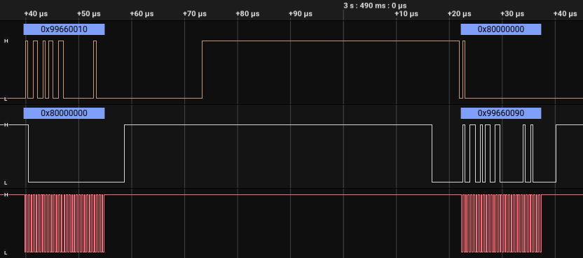](img/wireless/0x10.png)

- Send length: 0, Response length: 0
- First thing to be called after finishing the initialisation sequence.

#### Setup - `0x17`

[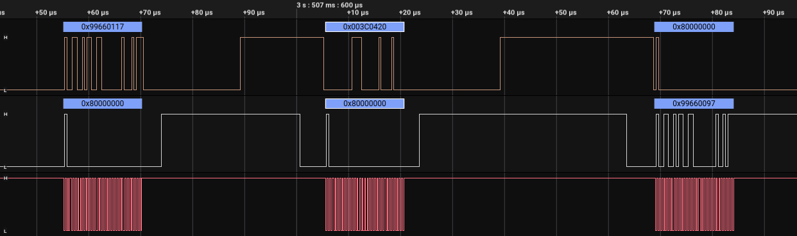](img/wireless/0x17.png)

- Send length: 1, response length: 0
- Games set this. It seems to setup the adapter's configuration.

Both Pokemon games and the multiboot ROM that the adapter sends when no cartridge is inserted use `0x003C0420`.

🔝 For a game, the most important bits are bits `16-17` (let's call this `maxPlayers`), which specify the maximum number of allowed players:

- `00`: 5 players (1 host and 4 clients)
- `01`: 4 players
- `10`: 3 players
- `11`: 2 players

⚠️ Clients must always set `maxPlayers` to `00`.

🛰️ Bits `8-15` specify the number of times the adapter would perform a transmission. The default is `0`, which means infinite retransmissions. Setting a value of `3` means: transmit once, and only retry two times if the other console didn't receive data. After the maximum number of transmissions is reached, the client is marked as _inactive_ and will appear on the extra parameter that the adapter sends (`0x99660128`) in the [waiting commands](#waiting).

⏲️ Bits `0-7` represent the timeout of the [waiting commands](#waiting). The default is _no timeout_ (`0`), but if this is set, the adapter will issue a `0x99660027` command after the timeout is reached. It's expressed in _frames_ (units of 16.6 ms).

#### Broadcast - `0x16`

[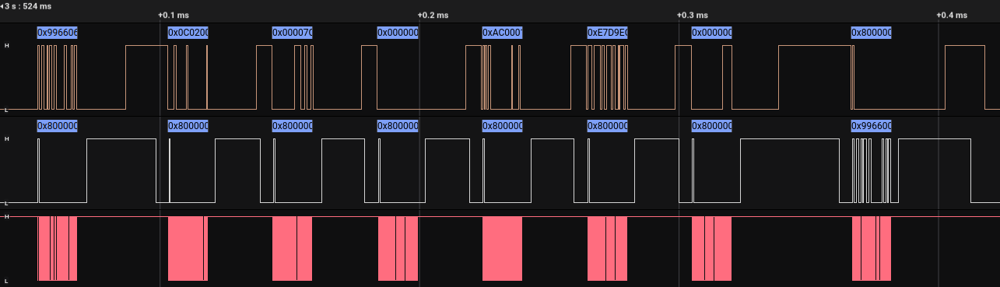](img/wireless/0x16.png)

- Send length: 6, response length: 0
- The data to be broadcast out to all adapters. Examples of use include the union room, broadcasting game name and username in download play, and the username in direct multiplayer in Pokémon.

💻 This is the first command used to start a server. The 6 parameters are the ASCII characters of the game and user name, plus some bytes indicating whether the server should appear in the Download Play list or not. Here's a byte by byte explanation:

[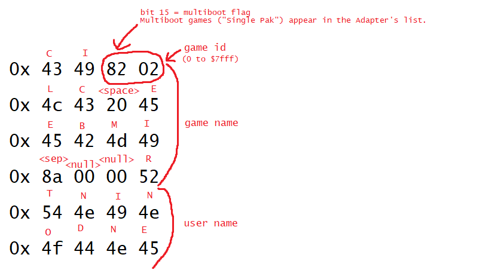](img/wireless/broadcast.png)

(if you read from right to left, it says `ICE CLIMBER` - `NINTENDO`)

🆔 The **Game ID** is what games use to avoid listing servers from another game. This is done on the software layer (GBA), the adapter does not enforce this in any way, nor does gba-link-connection (unless `LINK_UNIVERSAL_GAME_ID_FILTER` is set).

🔥 This command can be called to update the broadcast data even when the server has already started using `StartHost`. Some games include metadata in the game/user name fields, such as the player's gender or a busy flag.

#### StartHost - `0x19`

- Send length: 0, response length: 0
- This uses the broadcast data given by the broadcast command and actually does the broadcasting.

⏲ After calling this command, wait some time (~15 scanlines) before calling `PollConnections` or it will fail!.

#### EndHost - `0x1b`

- Send length: 0, response length: 2+
- This command stops host broadcast. This allows to "close" the room and stop allowing new clients, but also **keeping the existing connections alive**. Sends and Receives still work, but:
  - Clients cannot connect, even if they already know the host ID (`FinishConnection` will fail).
  - Calls to `PollConnections` on the host side will fail, unless `StartHost` is called again.

#### BroadcastRead - `0x1c`, `0x1d` and `0x1e`

[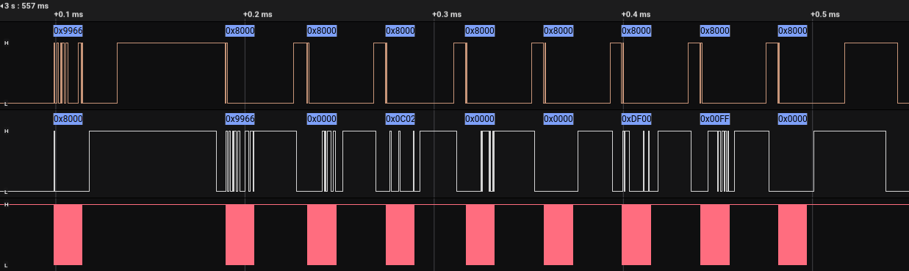](img/wireless/0x1d.png)

Let's call these `BroadcastReadStart`, `BroadcastReadPoll`, and `BroadcastReadEnd`.

- Send length: 0
- Response length:
  - `0x1c`: 0
  - `0x1d` and `0x1e`: and 7 \* number of broadcasts (maximum: 4)
- All currently broadcasting devices are returned here along with a word of **metadata** (the metadata word first, then 6 words with broadcast data).
- The metadata word contains:
  - First 2 bytes: Server ID. IDs have 16 bits.
  - 3rd byte: Next available slot. This can be used to check whether a player can join a room or not.
    - `0b00`: If you join this room, your `clientNumber` will be 0.
    - `0b01`: If you join this room, your `clientNumber` will be 1.
    - `0b10`: If you join this room, your `clientNumber` will be 2.
    - `0b11`: If you join this room, your `clientNumber` will be 3.
    - `0xff`: The server is full. You cannot join this room.
    - Although `LinkWireless` uses this to know the number of connected players, that only works because -by design- rooms are closed when a player disconnects. The hardware allows disconnecting specific clients, so if the next available slot is e.g. 2, it can mean that there are 3 connected players (1 host + 2 clients) or that there are more players, but the third client (`clientNumber` = 2) has disconnected and the slot is now free.
    - The number of available slots depends on `maxPlayers` (see [Setup](#setup---0x17)) and/or [EndHost](#endhost---0x1b).
  - 4th byte: Zero.

🆔 IDs are randomly generated. Each time you broadcast or connect, the adapter assigns you a new ID.

✅ Reading broadcasts is a three-step process: First, you send `0x1c` (you will get an ACK instantly and no data) to put the adapter in 'broadcast reading' mode, and start waiting until the adapter retrieves data (games usually wait 1 full second). Then, send a `0x1d` and it will return what's described above. Lastly, send a `0x1e` to finish the process (you can ignore what the adapter returns here), which exits broadcast reading mode. If you don't send that last `0x1e`, the next command will fail.

⌚ Although games wait 1 full second, small waits (like ~160ms) also work.

⚙️ Calling `0x1d` repeatedly will provide an updated list of up to 4 hosts, always in the same order within each call. If more than 4 hosts are available, the game must track the IDs found and loop through the `0x1c`, `0x1d`, and `0x1e` sequence to discover additional hosts. Each iteration of this sequence provides up to 4 hosts in the order they are discovered by the wireless adapter.

⏳ If a client sends a `0x1c` and then starts a `0x1d` loop (1 command per frame), and a console that was broadcasting is turned off, it disappears after 3 seconds.

#### PollConnections - `0x1a`

- Send length: 0, response length: 0+
- Polls new connections and returns a list with the connected adapters. The length of the response is zero if there are no connected adapters.
- It includes one value per connected client, in which the most significant byte is the `clientNumber` (see [IsConnectionComplete](#isconnectioncomplete---0x20)) and the least significant byte is the ID.

🔗 If this command reports 3 connected consoles, after turning off one of them, it will still report 3 consoles. Servers need to detect timeouts in another way.

❗ `0x19`, `0x1a` and `0x1b` behave like the 3 broadcast reading commands (`0x1c`, `0x1d` and `0x1e`), in the sense that `StartHost` puts the adapter in 'open host' mode, `PollConnections` polls new connections and `EndHost` exits the open host mode.

#### Connect - `0x1f`

[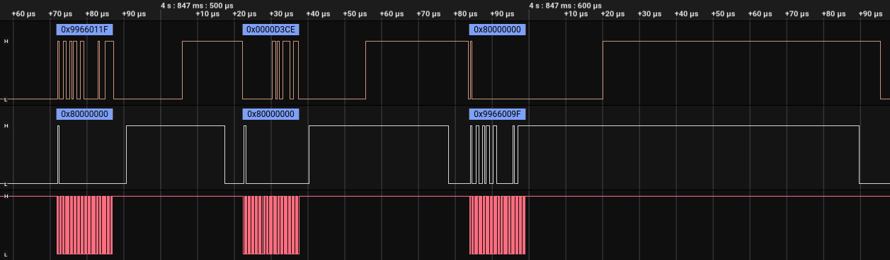](img/wireless/0x1f.png)

- Send length: 1, response length: 0
- Send the ID of the adapter you want to connect to from [BroadcastRead](#broadcastread---0x1c-0x1d-and-0x1e).

#### IsConnectionComplete - `0x20`

[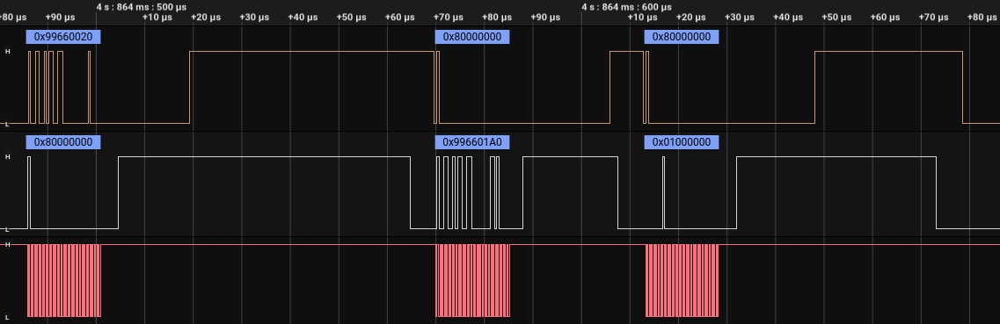](img/wireless/0x20.png)

- Send length: 0, response length: 1
- Responds with a 16 bit ID as lower 16 bits if finished, otherwise responds with `0x01000000`.

👆 It also responds in its bits 16 and 17 a number that represents the `clientNumber` (0 to 3). Lets say our ID is `abcd`, it will respond `0x0000abcd` if we are the first client that connects to that server, `0x0001abcd` if we are the second one, `0x0002abcd` third, and `0x0003abcd` fourth. Rooms allow 5 simultaneous adapters at max.

💥 If the connection failed, the `clientNumber` will be a number higher than `3`.

#### FinishConnection - `0x21`

[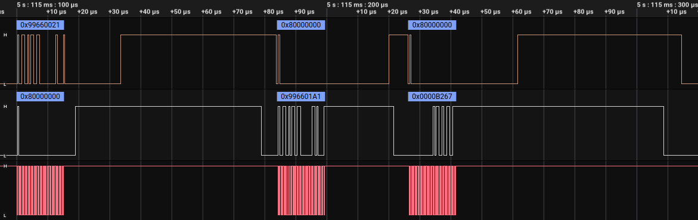](img/wireless/0x21.png)

- Send length: 0, response length: 1
- Called after [IsConnectionComplete](#isconnectioncomplete---0x20), responds with the final device ID (which tends to be equal to the ID from the previous command), the `clientNumber` in bits 16 and 17, and if all went well, zeros in its remaining bits.

#### SendData - `0x24`

- Send length: N, response length: 0
- Send N 32 bit values to connected adapter.

⚠️ The first value **is a header**, and has to be correct. Otherwise, the adapter will ignore the command and won't send any data. The header is as follows:

- For hosts: the number of `bytes` that come next. For example, if we want to send `0xaabbccdd` and `0x12345678` in the same command, we need to send:
  - `0x00000008`, `0xaabbccdd`, `0x12345678`.
- For clients: `(bytes << (3 + (1+clientNumber) * 5))`. The `clientNumber` is what I described in [IsConnectionComplete](#isconnectioncomplete---0x20). For example, if we want to send a single 4-byte value (`0xaabbccdd`):
  - The first client should send: `0x400`, `0xaabbccdd`
  - The second client should send: `0x8000`, `0xaabbccdd`
  - The third client should send: `0x100000`, `0xaabbccdd`
  - The fourth client should send: `0x2000000`, `0xaabbccdd`

🔝 Each `SendData` can send up to:

- **Host:** 87 bytes (or 21.75 values)
- **Clients:** 16 bytes (or 4 values)
- _(the header doesn't count)_

🗂️ Any non-multiple of 4 byte count will send LSB bytes first. For example, a host sending `0x00000003`, `0xaabbccdd` will result in bytes `0xbb`, `0xcc` and `0xdd` being received by clients (the clients will receive `0x00bbccdd`).

🤝 Note that when having more than 2 connected adapters, data is not transferred between different clients. If a client wants to tell something to another client, it has to talk first with the host with `SendData`, and then the host needs to relay that information to the other client.

👑 Internally, data is only sent when **the host** calls `SendData`:

- The send/receive buffer size is 1 packet, so calling `SendData` multiple times on either side (before the other side calls `ReceiveData`) will result in data loss.
- Clients only **schedule** the data transfer, but they don't do it until the host sends something. This is problematic because the command overrides previously scheduled transfers, so calling `SendData` multiple times on the client side before the host calls `SendData` would also result in data loss. I believe this is why most games use `SendDataWait` on the client side.
- Here's an example of this behavior:
  - **Client**: `SendData` `{sndHeader}`, `10`
  - **Host**: `SendData` `{sndHeader}`, `1` **(\*)**
    - _(here, the adapter internally receives the 10 from the client)_
  - **Host**: `SendData` `{sndHeader}`, `2`
    - _(here, the previous packet with 1 is lost since nobody received it yet)_
  - **Client**: `ReceiveData`
    - Receives `{rcvHeader}`, `2`
  - **Client**: `SendData` `{sndHeader}`, `20`
  - **Host**: `ReceiveData`
    - Receives `{rcvHeader}`, `10` _(pending from **(\*)**)_
  - **Host**: `ReceiveData`
    - Receives nothing
  - **Host**: `SendData` `{sndHeader}`, `3`
    - _(here, the adapter internally receives the 20 from the client)_
  - **Host**: `ReceiveData`
    - Receives `{rcvHeader}`, 20

🔁 This command can also be used with one header and **no data**. In this case, it will resend the last N bytes (based on the header), up to 4. This is probably just garbage that stays in the hardware buffer, but since clients cannot take initiative, some games send 1 byte and no data on the server side to let clients talk. Until we have a better name, we'll call this **ghost sends**.

#### SendDataWait - `0x25`

[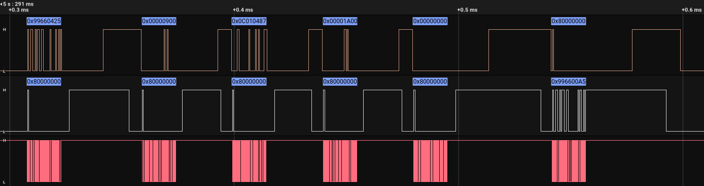](img/wireless/0x25.png)

- Send length: N, response length: 0
- The same as [SendData](#senddata---0x24) but with the additional effect of [Wait](#wait---0x27)
- See [Waiting](#waiting) for more details on this.

#### ReceiveData - `0x26`

[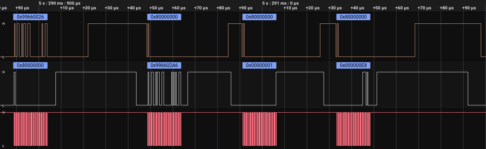](img/wireless/0x26.png)

- Send length: 0, response length: N
- Responds with all the data from all adapters. No IDs are included, this is just what was sent concatenated together.
- Once data has been pulled out, it clears the data buffer, so calling this again can only get new data.

🧩 The data is only concatenated on the host side, and its order is based on the `clientNumber`. It doesn't matter who called `SendData` first.

⚠️ When the data is concatenated, the **headers** sent to [SendData](#senddata---0x24) are not included, just the raw data. A single header is included as the first value of the response. This header is as follows:

- Bits `0-6`: # of received bytes from host.
- Bits `8-12`: # of received bytes from client 0.
- Bits `13-17`: # of received bytes from client 1.
- Bits `18-22`: # of received bytes from client 2.
- Bits `23-27`: # of received bytes from client 3.
- The rest of the bits are `0`.

🧱 Concatenation is done at **byte** level. So, for example, if client 3 sends 3 bytes (`0xAABBCC`) and client 1 sends 2 bytes (`0xDDEE`), the host would receive 3 words:

- (header) `0b0000_00011_00000_00000_00010_0_0000000`, `0xEEAABBCC`, `0x000000DD`

#### Wait - `0x27`

[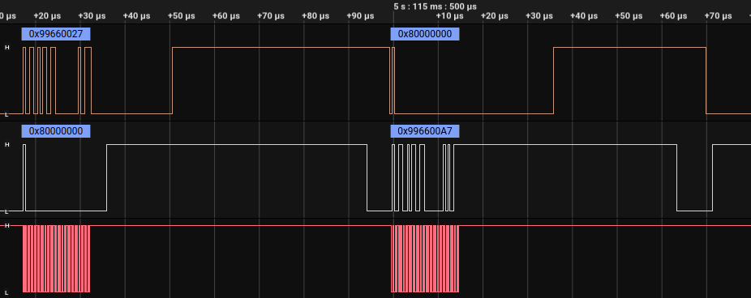](img/wireless/0x27.png)

- Send length: 0, response length: 0
- See [Waiting](#waiting) for more details on this.

#### DisconnectClient - `0x30`

[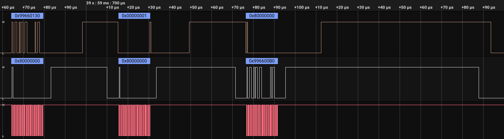](img/wireless/0x30.png)

- Send length 1, reponse length: 0
- This command disconnects clients. The argument is a bitmask of the client ID to disconnect. Sending `0x1` means "disconnect client number 0", sending `0x2` means "disconnect client number 1", and sending `0xF` would disconnect all the clients. After disconnecting a client, its ID won't appear on `PollConnections` calls and its `clientNumber` will be liberated, so other peers can connect.

⚡ The clients also are able to disconnect themselves using this command, but they can only send its corresponding bit or `0xF`, other bits are ignored (they cannot disconnect other clients). Also, the host won't know if a client disconnects itself, so this feature is not very useful:

- The host still needs to monitor clients to ensure they are still alive (ie. through some PING like mechanism) and disconnect them if they are not, to allow new clients to connect. [4](#pokered)

#### Bye - `0x3d`

- Send length: 0, Response length: 0
- This sets the adapter in a low power consumption mode. Games use it when the player exits the multiplayer mode. To use the adapter again after this command, a new reset/initialization is needed.

### Other commands

#### SignalLevel - `0x11`

[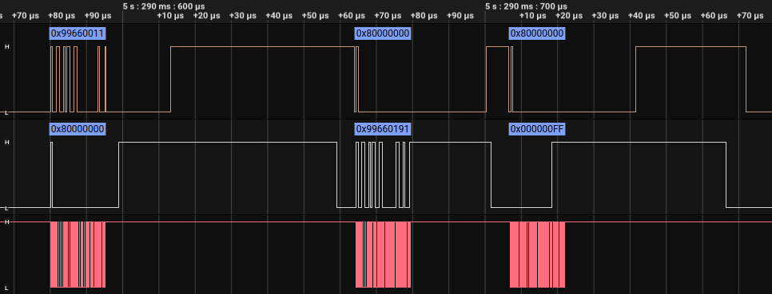](img/wireless/0x11.png)

- Send length: 0, response length: 1
- This returns the signal level of the other adapters from `0` to `0xFF` (`0` means disconnected).
- The levels are returned in a single value, the first byte being the signal level of client 0, and the last byte being the signal level of client 3.
- When called from a client, it only returns the signal level of that client in its corresponding byte. The rest of the bytes will be `0`.

#### VersionStatus - `0x12`

- Send length: 0, Response length: 1

- In my adapter, it always returns `8585495` (decimal). It contains the hardware and firmware version of the adapter.

#### SystemStatus - `0x13`

- Send length: 0, Response length: 1

- Returns some information about the current connection and device state. The returned word contains:

* Bits `0-15`: The device ID (or zero if the device is not connected nor hosting).
* Bits `16-23`: A 4-bit array with slots. If the console is a client, it'll have a 1 in the position assigned to that slot (e.g. the one with `clientNumber` 3 will have `0100`). The host will always have `0000` here.
* Bits `24-31`: A number indicating the state of the adapter
  - `0` = idle
  - `1` = serving (host), closed room
  - `2` = serving (host), open room
  - `3` = searching
  - `4` = connecting
  - `5` = connected (client)

#### SlotStatus - `0x14`

- Send length: 0, Response length: 1+

- It's returns a list of the connected adapters, similar to what `PollConnections` responds, but also:

  - `SlotStatus` has an extra word at the start of the response, indicating the `clientNumber` that the next connection will have (or `0xFF` if the room is not accepting new clients).
  - `SlotStatus` can be called after `EndHost`, while `PollConnections` fails.

#### ConfigStatus - `0x15`

- Send length: 0, Response length: 7 (as client), or 8 (as host)
- Returns the adapter configuration.

🤔 In my tests...

- As client, it returned: `0, 0, 0, 0, 0, 0, 257`.
- As host, it returned: `1, 2, 3, 4, 5, 6, 3933216, 257`.
  - `1, 2, 3, 4, 5, 6` would be the broadcast data.
  - `3933216` is the value used in the [Setup](#setup---0x17) command (`0x003C0420`).
  - No idea what `257` this means.

#### RetransmitAndWait - `0x37`

- Send length: 0, Response length: 0
- Retransmits the last data from a host to all clients, with the additional effect of [Wait](#wait---0x27)
- See [Waiting](#waiting) for more details on this.

### Unknown commands

If we analyze whether a command ID throws an 'invalid command' error (`0x996601ee` with error code `2`), we can know that there are **more commands**. I don't know what these commands do.

- `0x18`
- `0x32`
- `0x33`
- `0x34`
- `0x35` (puts the GBA in [Waiting](#waiting) state)
- `0x38`
- `0x39`

## Waiting

[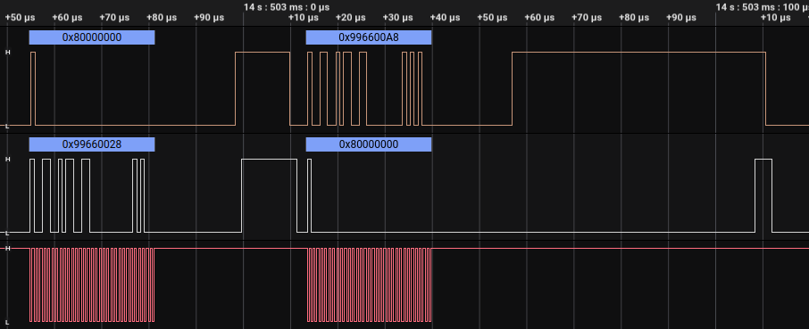](img/wireless/wake-up.png)

- After either [SendDataWait](#senddatawait---0x25) or [Wait](#wait---0x27), clock control switches to the wireless adapter.
- Once the adapter has something to tell the GBA about, the _adapter_ sends a command to the GBA (usually `0x99660028`).
- These transfers are dealt with in much the same way as before but with the roles of the GBA and the adapter reversed, see the figure!
- The GBA then sends the response back (e.g. `0x996600A8` as `0x28` + `0x80` = `0xA8`).
- After this, control of the clock returns to the GBA, and it can start sending commands back again. For example this might be receiving the command sent by the other device using [ReceiveData](#receivedata---0x26).

⌚ This timeouts after 500ms of the adapter not having anything to tell the GBA about. In this case, the adapter sends `0x99660027`. **This is only true if the console has used the [Setup](#setup---0x17) command before**. The value that most games use (`0x003C0420`) contains this timeout value, but the default is zero (no timeout).

✅ When there's new data available, the adapter sends to the GBA a `0x99660028`.

💨 Clients receive the `0x28` when new data from the host is available, but the host receives it immediately (well, after the transfer completes), as it can be used to know which clients received data or are disconnected.

⚠️ If some children didn't receive the data, the adapter sends to the host GBA a `0x99660128`.

- The extra parameter has two bitarrays:
  - Bits `0-4`: The clients that _received_ data.
  - Bits `8-11`: The clients marked as _inactive_. This depends on the # of maximum transmissions configured with the [Setup](#setup---0x17) command. It only marks them as inactive after 4 seconds.

🔗 When the adapter is disconnected from the host, it sends a `0x99660029`.

- Bit 8 of the response indicates the reason:
  - `0` = manual disconnect (aka the host used [DisconnectClient](#disconnectclient---0x30))
  - `1` = the connection was lost

◀ **Inverted ACKs**

While the clock is inverted, the acknowledge procedure is 'standard' but with the inverted roles

[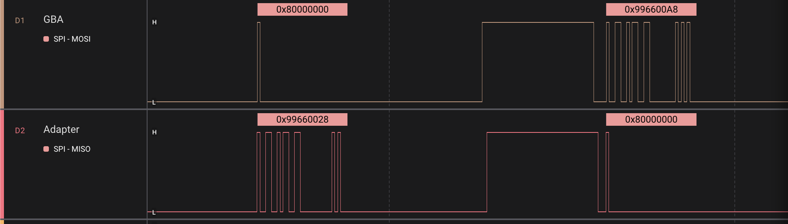](img/wireless/ack-inverted.png)

1.  The adapter goes low as soon as it can.
2.  The GBA goes high.
3.  The adapter goes high.
4.  The GBA goes low _when it’s ready_, but **wait at least 40us**! (\*)
5.  The adapter goes low when it's ready.
6.  The adapter starts a transfer, clock starts pulsing, and both sides exchange the next 32 bit value.

> (\*) Clock inversion is _finicky_. If you don't wait enough time between transfers, the adapter will desync _forever_ (well, until you reset it with _SD=HIGH_). `LinkWireless` doesn't use wait commands and calls the regular `SendData` instead, it's less efficient but way more reliable.

## Wireless Multiboot

> You can learn more details by reading [LinkWirelessMultiboot.hpp](../lib/LinkWirelessMultiboot.hpp)'s code.

To host a 'multiboot' room, a host sets the **multiboot flag** (bit 15) in its game ID (inside broadcast data) and starts serving.

1. For each new client that connects, it runs a small handshake where the client sends their 'game name' and 'player name'. The bootloader always sends `RFU-MB-DL` as game name and `PLAYER A` (or `B`, `C`, `D`) as player name.

2. When the host player confirms that all players are ready, it sends a 'rom start' command.

3. The host sends the rom bytes in 84-byte chunks.

4. The host sends a 'rom end' command and the games boot.

5. Since the adapter hardware is still connected, the games 'restore' the SDK state to preserve the session and avoid reconnecting clients. The `0x13` command returns whether we are a server or a client, as well as the client number.

### Valid header

The bootloader will only accept ROMs with valid headers: they must contain this in their bytes `4-15`:

`0x52, 0x46, 0x55, 0x2d, 0x4d, 0x42, 0x4f, 0x4f, 0x54, 0x00, 0x00, 0x00`

(this represents the string `RFU-MBOOT` and zeros)

When the bootloader accepts the ROM, it will run the jump instruction located at the first byte. No extra headers are required apart from these 16 bytes.

`LinkWirelessMultiboot` patches the header on the fly, so users can compile their ROMs for cabled Multiboot and also use them wirelessly.

### Official protocol

> You can learn more details by reading [LinkWirelessOpenSDK.hpp](../lib/LinkWirelessOpenSDK.hpp)'s code.

All this communication uses an 'official' software-layer protocol made by Nintendo, the same one used by first-party games.

Server buffers use a 3-byte header:

```c++
struct ServerSDKHeader {
  unsigned int payloadSize : 7;
  unsigned int _unused_ : 2;
  unsigned int phase : 2;
  unsigned int n : 2;
  unsigned int isACK : 1;
  CommState commState : 4;
  unsigned int targetSlots : 4;
}
```

Clients use a 2-byte header:

```c++
struct ClientSDKHeader {
  unsigned int payloadSize : 5;
  unsigned int phase : 2;
  unsigned int n : 2;
  unsigned int isACK : 1;
  CommState commState : 4;
}
```

...and `CommState` is:

```c++
enum CommState : unsigned int {
  OFF = 0,
  STARTING = 1,
  COMMUNICATING = 2,
  ENDING = 3,
  DIRECT = 4
};
```

- All transfers have sequence numbers (`n` and `phase`) unless `commState` is `DIRECT` (a sort of UDP).
- There's a short initialization ritual until reaching the `COMMUNICATING` state.
- Once the `COMMUNICATING` state is reached, the initial sequence is `n=1, phase=0`.
- After each packet, the other node responds with a packet containing the same `n`, `phase` and `commState`, but with the `isACK` bit set.
- The sequence continues: `n=1,ph=1` | `n=1,ph=2` | `n=1,ph=3` | `n=2,ph=0` | `n=2,ph=1` | `n=2,ph=2` | `n=2,ph=3` | `n=3,ph=0` | `n=3,ph=1` | `n=3,ph=2` | `n=3,ph=3` | `n=0,ph=0` | `n=0,ph=1` | `n=0,ph=2` | `n=0,ph=3` | `n=1,ph=0` | `n=1,ph=1` | etc.
- Repeated or old sequence numbers are ignored, that's how they handle retransmission.
- Transfers can contain more than one packet.
- As the maximum transfer lengths are `87` (server) and `16` (client), based on header sizes, the maximum payload lengths are `84` and `14`.
- The `targetSlots` field inside the server header is a bit array that indicates which clients the message is directed to. E.g. `0b0100` means 'client 2 only' and `0b1111` means 'all clients'.
- In `ServerSDKHeader` and `ClientSDKHeader`, all the non-documented bits (including `_unused_`) should be `0`. Otherwise, the official SDK might not respond!

### (1) Client handshake

- Server: repeatedly performs _ghost sends_ (see [SendData](#senddata---0x24)) until the client talks
- Client: sends `0x06010486`, `0x00001A00`
  - Header: `0x0486` (`size=6, n=1, ph=0, ack=0, commState=1`) (`1 = STARTING`)
  - Payload: `0x01`, `0x06`, `0x00`, `0x1A`, `0x00`, `0x00`
- Server: ACKs the packet (`size=0, n=1, ph=0, ack=1, commState=1`)
- Client: sends `0x00000501`
  - Header: `0x0501` (`size=1, n=2, ph=0, ack=0, commState=1`)
  - Payload: `0x00`
- Server: ACKs the packet
- Client: sends `0x00000886`, `0x2D554652`
  - Header: `0x0886` (`size=6, n=1, ph=0, ack=0, commState=2`) (`2 = COMMUNICATING`)
  - Payload: `0x00`, `0x00`, `0x52`, `0x46`, `0x55`, `0x2D`
    - => `RFU-`
- Server: ACKs the packet
- Client: sends `0x424D08A6`, `0x004C442D`
  - Header: `0x08A6` (`size=6, n=1, ph=1, ack=0, commState=2`)
  - Payload: `0x4D`, `0x42`, `0x2D`, `0x44`, `0x4C`, `0x00`
    - => `MB-DL`
- Server: ACKs the packet
- Client: sends `0x000008C6`, `0x50000000`
  - Header: `0x08C6` (`size=6, n=1, ph=2, ack=0, commState=2`)
  - Payload: `0x00`, `0x00`, `0x00`, `0x00`, `0x00`, `0x00`, `0x50`
    - => `P`
- Server: ACKs the packet
- Client: sends `0x414C08E6`, `0x20524559`
  - Header: `0x08E6` (`size=6, n=1, ph=3, ack=0, commState=2`)
  - Payload: `0x4C`, `0x41`, `0x59`, `0x45`, `0x52`, `0x20`
    - => `LAYER `
- Server: ACKs the packet
- Client: sends `0x00410902`
  - Header: `0x0902` (`size=2, n=2, ph=0, ack=0, commState=2`)
  - Payload: `0x41`, `0x00`
    - => `A`
- Server: ACKs the packet
- Client: sends `0x00000C00`
  - Header: `0x0C00` (`size=0, n=0, ph=0, ack=0, commState=3`) (`3 = ENDING`)
  - No payload
- Server: ACKs the packet
- Client: sends `0x00000080`
  - Header: `0x0080` (`size=0, n=1, ph=0, ack=0, commState=0`) (`0 = OFF`)
  - No payload
- Server: Ghost send _(OFF state doesn't expect an ack!)_

## (2) ROM start command

- Server: sends `0x00044807`, `0x00000054`, `0x00000002`
  - Header: `0x044807` (`size=7, n=1, ph=0, ack=0, commState=1`) (`1 = STARTING`)
  - Payload: these 7 bytes depend on the game
    - _No No No Puzzle Chailien_ sends: `0x00`, `0x54`, `0x00`, `0x00`, `0x00`, `0x02`, `0x00`
    - _Super Mario Bros Famicom Mini_ sends: `0x00`, `0x54`, `0x00`, `0xFC`, `0x44`, `0x01`, `0x00`
- Client: ACKs the packet (`size=0, n=1, ph=0, ack=1, commState=1`)

## (3) ROM bytes

- At this stage, `commState` is already `2` (`COMMUNICATING`) and the ROM bytes are sent in 84-byte chunks.
- The last transfer is also `84` bytes, no matter the ROM size (it's padded with zeros).
- A number (2~4) of 'inflight packets' is allowed to speed up transfers.
- Packets without an ACK are retransmitted.

## (4) ROM end command

After all ROM chunks are ACK'd, the last transfers are:

- `size=0, n=0, ph=0, ack=0, commState=3` (`3 = ENDING`)
- `size=0, n=1, ph=0, ack=0, commState=0` (`0 = OFF`)
  - _OFF state, so this one is not acknowledged by the clients!_

## SPI config

Here's how SPI works on the GBA:

[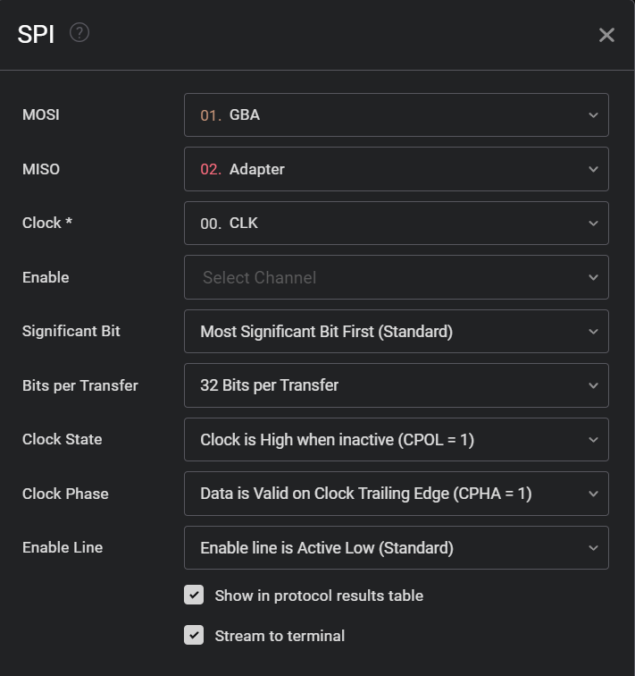](img/wireless/logic2.png)

# I know more!

If you know any extra details about the wireless adapter, get in touch!. For specific details I’ve left footnotes around if you happen to know that piece of information.

1.  Multiboot is what we call a rom that can be booted over link cable. This can be used for something akin to download play software for the DS. [↩︎](#fnref:multiboot)
2.  [Games compatible with the wireless adapter](https://en.wikipedia.org/wiki/Game_Boy_Advance_Wireless_Adapter#Compatible_games) [↩︎](#fnref:list_of_games)
3.  [Send me an email if you know more about this](https://blog.kuiper.dev/contact)

4.  Some interesting data about the RFU adapter can be found in Pokemon Games, see the [FireRed Decompilation](https://github.com/pret/pokefirered/blob/49ea462d7f421e75a76b25d7e85c92494c0a9798/include/librfu.h#L44) for more information.
